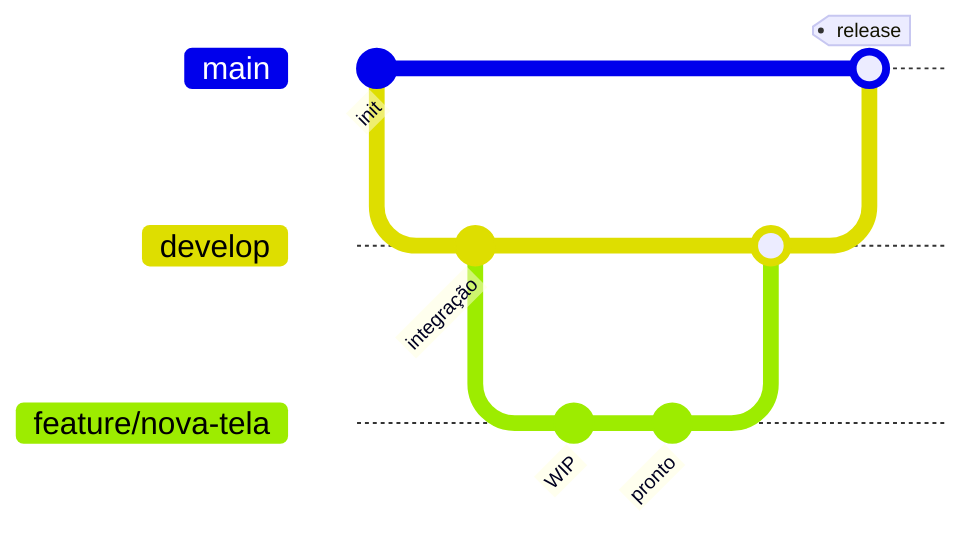

# Git Workflow — Vinicius Portfolio

Este repositório segue um **Git Flow simplificado** para produção estável e integração contínua em `develop`.

## Branches

| Branch | Propósito | Deploy / ambiente |
|--------|-----------|-------------------|
| `main` | Produção — apenas código revisado e estável | Produção |
| `develop` | Integração contínua — merge de features | Staging / preview (opcional) |
| `feature/*` | Uma funcionalidade ou correção isolada | Local |

### Convenção de nomes

```text
feature/contact-form-validation
feature/admin-chat-typing-indicator
fix/mobile-menu-overflow
chore/update-dependencies
```

Use prefixos: `feature/`, `fix/`, `chore/`, `docs/`, `refactor/`.

## Fluxo diário



1. **Atualize `develop`:** `git checkout develop` → `git pull origin develop`
2. **Crie a feature:** `git checkout -b feature/nome-curto`
3. **Desenvolva** com commits pequenos e mensagens claras
4. **Abra PR** para `develop` (nunca direto em `main` para features)
5. **Após QA em `develop`**, abra PR `develop` → `main` para release

## Merge — boas práticas

### Feature → develop

- Rebase ou merge de `develop` na feature **antes** do PR se a branch estiver antiga
- Prefira **squash merge** no GitHub para histórico limpo em features pequenas
- Use **merge commit** quando a feature tiver commits semanticamente separados que valem preservar
- Exija: lint/typecheck (`interfaces/web`), revisão de código, descrição do PR com escopo e test plan

### Develop → main (release)

- Apenas quando `develop` estiver estável e testado
- Tag opcional: `v0.2.0` após merge
- **Nunca** force-push em `main` ou `develop`
- Hotfix crítico em produção: `hotfix/*` a partir de `main` → merge em `main` **e** `develop`

### O que evitar

- Commits diretos em `main` (exceto hotfix emergencial documentado)
- PRs grandes sem revisão incremental
- `git push --force` em branches compartilhadas

## Migração `master` → `main` (remoto)

Se o GitHub ainda usa `master` como default:

1. Local: `git branch -m master main` (já feito neste repo)
2. `git push -u origin main`
3. GitHub → **Settings → Branches** → default branch: `main`
4. `git push origin develop`
5. Opcional: apagar `master` remoto após validar deploys

## Proteção recomendada (GitHub)

- `main`: require PR, 1 approval, status checks (build)
- `develop`: require PR, status checks
- Bloquear force push em `main` e `develop`

## Estrutura do monorepo

```text
vinicius-portfolio/
├── backend/           # FastAPI
├── interfaces/web/    # React 19 + Vite — frontend no host (dev)
├── docs/              # Especificações e workflow
└── .cursor/           # MCP e regras do agente
```

Frontend: sempre `yarn` em `interfaces/web/` (ver regra do projeto).
