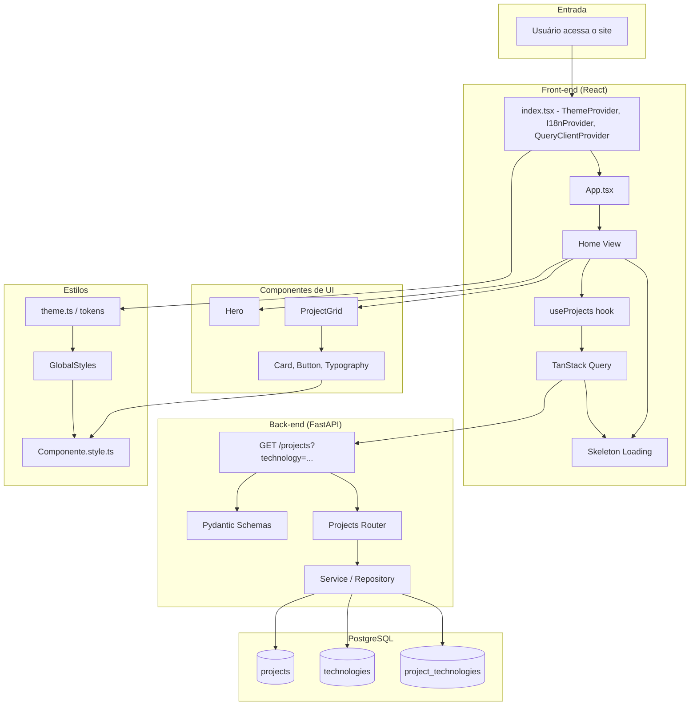

# Especificação Técnica — Portfólio Profissional Full-Stack

## Referência
Requisito funcional: `docs/portfolio/functional_requirements/feature_requirement_pt-br.md`

---

## 1. Visão Geral e Decisões Técnicas

| Decisão | Escolha | Justificativa |
|--------|---------|---------------|
| **Monorepo** | Raiz com `/backend` (FastAPI) e `/frontend` (React — ex.: `vinicius-portfolio`) | Centralização, clone único, documentação e deploy coordenados (RF01, RN07). |
| **Backend** | FastAPI (Python 3.11+) + SQLAlchemy 2.x + PostgreSQL | API moderna, tipagem, documentação OpenAPI automática; ORM maduro e relacionamentos Many-to-Many nativos. |
| **Banco de dados** | PostgreSQL com tabelas `projects`, `technologies` e tabela de associação Many-to-Many | Dados dinâmicos, escaláveis; tecnologias reutilizáveis entre projetos (RF03). |
| **API** | REST; GET /projects com query param `technology` para filtro; Pydantic para entrada/saída | Validação rigorosa, contrato claro para o front-end; filtragem sem overload de endpoints (RF03). |
| **CORS** | Configurado na FastAPI para origens do front-end (dev e prod) | Segurança e compatibilidade com consumo cross-origin pelo React (RF03). |
| **Front-end: dados** | TanStack Query + Custom Hook `useProjects` consumindo GET /projects | Cache, loading/error states, desacoplamento da UI da fonte de dados (RF04, RF05). |
| **Front-end: UX** | Skeleton Loading na listagem de projetos enquanto a API responde | Sensação de fluidez e profissionalismo (RF05). |
| **i18n** | react-i18next | Mantido; detecção de idioma, namespaces, fallback; textos de UI e mensagens de estado (RF06). |
| **Design tokens / tema** | Theme object (JS) + variáveis CSS na raiz; styled-components consomem `theme` | Preparação para dark mode; consistência (RF02, RF09). |
| **Idioma padrão** | en-US quando navegador não for pt-BR nem en-US | Fallback seguro e alinhado a público internacional. |
| **Seletor de idioma** | Toggle PT/EN na interface | Recrutadores podem testar ambos os idiomas. |
| **Backend: erros** | Exception handlers globais + logging estruturado (nível, contexto, sem stack no response) | Resiliência e operação profissional (RF07). |

---

## 2. Arquitetura

### 2.1 Diagrama de fluxo (Monorepo Full-Stack)



### 2.2 Visão do Monorepo

```
Portifolio/                    # raiz do monorepo
├── backend/                   # FastAPI + SQLAlchemy
│   ├── app/
│   │   ├── api/
│   │   ├── core/
│   │   ├── models/
│   │   ├── schemas/
│   │   ├── services/
│   │   └── main.py
│   ├── requirements.txt
│   └── .env.example
├── frontend/                  # ou vinicius-portfolio/
│   └── src/
│       ├── components/
│       ├── hooks/             # useProjects
│       ├── api/               # client HTTP, endpoints
│       ├── data/              # eventual fallback ou tipos
│       ├── i18n/
│       ├── styles/
│       └── views/
├── docs/
└── README.md
```

### 2.3 Componentes impactados

| Componente / Módulo | Impacto | Descrição |
|---------------------|---------|-----------|
| **backend/** | Novo | API FastAPI, modelos SQLAlchemy, schemas Pydantic, CORS, exception handlers, logging. |
| **frontend/src/App.tsx** | Alto | Envolver com `QueryClientProvider` (TanStack Query); manter `I18nProvider` e `ThemeProvider`. |
| **frontend/src/index.tsx** | Médio | Inicializar i18n; QueryClient já pode ser criado no App ou aqui. |
| **frontend/src/views/Home/Home.tsx** | Alto | Não importar `projects` de data; usar `useProjects()` e exibir Skeleton quando `isLoading`; repassar dados ao `ProjectGrid`. |
| **frontend/src/hooks/useProjects.ts** | Novo | Hook que usa `useQuery` para GET /projects com opcional filtro por tecnologia; retorna `{ data, isLoading, isError, error }`. |
| **frontend/src/api/** | Novo | Cliente HTTP (fetch ou axios) com baseURL da API; funções `getProjects(technology?: string)`. |
| **frontend/src/components/ProjectGrid/** | Alto | Receber lista de projetos da API (ou estado vazio); exibir Skeleton quando loading; "Ver código" e "Ver demo" conforme antes. |
| **frontend/src/components/ProjectCardSkeleton/** | Novo | Componente de Skeleton para um card de projeto (layout idêntico ao Card, conteúdo placeholder). |
| **frontend/src/data/projects.ts** | Remover/Deprecar | Substituído pela API; manter apenas tipos TypeScript (Project, Technology) se não vierem do backend. |
| **frontend/src/styles/theme.ts** | Manter | Sem mudança de contrato. |
| **frontend/src/i18n/** | Médio | Incluir chaves para "Carregando projetos...", mensagens de erro de API e lista vazia. |

---

## 3. Detalhamento Backend

### 3.1 Estrutura de diretórios (backend)

```
backend/
├── app/
│   ├── __init__.py
│   ├── main.py              # FastAPI app, CORS, exception handlers, routers
│   ├── api/
│   │   ├── __init__.py
│   │   └── v1/
│   │       ├── __init__.py
│   │       └── endpoints/
│   │           └── projects.py
│   ├── core/
│   │   ├── __init__.py
│   │   ├── config.py        # Settings (pydantic-settings): DB URL, CORS origins
│   │   ├── logging.py      # Configuração de logging estruturado
│   │   └── exceptions.py   # Exception handlers globais
│   ├── models/
│   │   ├── __init__.py
│   │   ├── project.py
│   │   └── technology.py
│   ├── schemas/
│   │   ├── __init__.py
│   │   ├── project.py       # ProjectRead, ProjectList, filtros
│   │   └── technology.py   # TechnologyRead
│   ├── services/
│   │   ├── __init__.py
│   │   └── project_service.py
│   └── db/
│       ├── __init__.py
│       ├── base.py         # Base declarativa SQLAlchemy
│       └── session.py     # get_db, engine
├── requirements.txt
├── .env.example
└── README.md
```

### 3.2 Modelagem de dados (SQLAlchemy)

**Tabelas:**

- **projects**  
  - `id` (PK, UUID ou Integer auto)  
  - `title` (String, not null)  
  - `description` (Text, nullable)  
  - `repository_url` (String, not null)  
  - `demo_url` (String, nullable)  
  - `created_at` / `updated_at` (DateTime, opcional)

- **technologies**  
  - `id` (PK)  
  - `name` (String, unique, not null)  
  - `slug` (String, unique, opcional, para filtro na URL)

- **project_technologies** (associação Many-to-Many)  
  - `project_id` (FK → projects.id)  
  - `technology_id` (FK → technologies.id)  
  - PK composta `(project_id, technology_id)`

**Relacionamento:**  
Cada `Project` tem uma lista de `Technology`; cada `Technology` pode estar em vários `Project`. Uso de `relationship()` e `secondary=project_technologies` no SQLAlchemy.

### 3.3 API REST

**Endpoint:**

- **GET /api/v1/projects**
  - **Query params (opcional):** `technology` (string): filtra projetos que possuem essa tecnologia (por nome ou slug).
  - **Resposta:** 200, lista de projetos com tecnologias aninhadas.
  - **Exemplo:** `GET /api/v1/projects?technology=React`

**Contrato de resposta (exemplo):**

```json
[
  {
    "id": "uuid-ou-int",
    "title": "Sistema de Design",
    "description": "Biblioteca de componentes...",
    "repository_url": "https://github.com/...",
    "demo_url": "https://...",
    "technologies": [
      { "id": 1, "name": "React", "slug": "react" }
    ]
  }
]
```

### 3.4 Pydantic Schemas

- **TechnologyRead:** `id`, `name`, `slug` (opcional).
- **ProjectRead:** `id`, `title`, `description`, `repository_url`, `demo_url`, `technologies: list[TechnologyRead]`.
- **Filtro de query:** modelo para `technology: Optional[str]` na query string.

Validação rigorosa em todas as entradas e saídas; uso de `response_model` nos endpoints.

### 3.5 CORS

- Configurar `CORSMiddleware` no `main.py` com `allow_origins` apontando para a URL do front-end em desenvolvimento (ex.: `http://localhost:5173`) e, quando houver, para a origem de produção.
- Evitar `allow_origins=["*"]` em produção.

### 3.6 Tratamento de exceções e logs

- **Exception handlers globais:**  
  - Capturar exceções genéricas e exceções de banco (ex.: SQLAlchemy); retornar resposta HTTP padronizada (ex.: 500 com `{"detail": "Internal server error"}`) sem expor stack no body.
- **Logging:**  
  - Configurar logging (ex.: `logging` ou `structlog`) com nível por ambiente (DEBUG em dev, INFO/ERROR em prod).  
  - Em erros: registrar nível ERROR com contexto (endpoint, método, request_id se houver, mensagem e stack no log apenas no servidor, nunca no response).

---

## 4. Detalhamento Frontend

### 4.1 Estrutura de diretórios proposta (frontend)

```
src/
├── api/
│   ├── client.ts        # instância HTTP (baseURL da API)
│   └── projects.ts      # getProjects(technology?: string)
├── components/
│   ├── Button/
│   ├── Card/
│   ├── Hero/
│   ├── LanguageToggle/
│   ├── ProjectGrid/
│   ├── ProjectCardSkeleton/   (novo)
│   └── Typography/
├── hooks/
│   └── useProjects.ts   (novo) — useQuery, retorna { data, isLoading, isError, error }
├── data/
│   └── types.ts         # tipos Project, Technology (espelhando API ou gerados)
├── i18n/
│   ├── config.ts
│   └── locales/
│       ├── pt-BR.json
│       └── en-US.json
├── styles/
│   ├── GlobalStyles.ts
│   └── theme.ts
├── views/
│   └── Home/
├── App.tsx
└── index.tsx
```

### 4.2 Interfaces (TypeScript) — alinhadas à API

```ts
// src/data/types.ts ou src/api/projects.ts

export interface Technology {
  id: number;
  name: string;
  slug?: string;
}

export interface Project {
  id: string | number;
  title: string;
  description: string | null;
  repository_url: string;
  demo_url: string | null;
  technologies: Technology[];
}
```

### 4.3 Camada API (frontend)

- **client:** criar instância com `baseURL` da variável de ambiente (ex.: `VITE_API_URL` ou `REACT_APP_API_URL`).
- **getProjects(technology?: string):** função que chama `GET /api/v1/projects` com `params: { technology }` quando informado; retorna `Promise<Project[]>`.

### 4.4 Hook useProjects

- Usar `useQuery` do TanStack Query.
  - **Query key:** `['projects', technology ?? 'all']` para cache por filtro.
  - **Query function:** chamar `getProjects(technology)`.
- Retornar: `{ data, isLoading, isError, error }` (e refetch se necessário).
- Opcional: parâmetro `technology?: string` no hook para filtrar direto na chamada.

### 4.5 Skeleton Loading

- Componente **ProjectCardSkeleton** que replica layout do card (título, descrição, tags, botões) com placeholders animados (ex.: `border-radius` + animação de brilho ou pulsação).
- Na **Home**, quando `useProjects().isLoading === true`, renderizar um grid de `ProjectCardSkeleton` (ex.: 3 ou 6 itens) em vez da lista de projetos.
- Quando `isLoading === false`, exibir `ProjectGrid` com `data` ou estado vazio (mensagem i18n).

### 4.6 i18n e estados

- Adicionar chaves para:
  - "Carregando projetos..." (ou similar).
  - "Não foi possível carregar os projetos." (erro genérico).
  - "Nenhum projeto encontrado." / "Nenhum projeto disponível no momento." (lista vazia).
- Manter chaves de Hero, botões "Ver código" e "Ver demo" como já definido.

### 4.7 Lógica de componentes (resumo)

- **Home:**  
  - `const { data: projects, isLoading, isError, error } = useProjects(technologyFilter);`  
  - Se `isLoading` → grid de `ProjectCardSkeleton`.  
  - Se `isError` → mensagem de erro amigável (i18n).  
  - Se `projects?.length === 0` → mensagem de lista vazia (i18n).  
  - Caso contrário → `ProjectGrid projects={projects} />`.
- **ProjectGrid:** recebe `projects: Project[]` (da API); para cada item exibe Card com título, descrição, tecnologias (tags), "Ver código" e "Ver demo" (se `demo_url` existir).
- **Hero / LanguageToggle / tema:** sem mudança de contrato em relação à especificação anterior.

---

## 5. Checklist de Implementação

### Backend

1. **Ambiente e estrutura**
   - [ ] Criar pasta `backend/` na raiz do monorepo.
   - [ ] Configurar `requirements.txt` (FastAPI, uvicorn, sqlalchemy, psycopg2-binary, pydantic-settings, python-dotenv).
   - [ ] Criar `.env.example` com `DATABASE_URL`, `CORS_ORIGINS` (ou equivalente).

2. **Banco e modelos**
   - [ ] Configurar SQLAlchemy (engine, session, Base).
   - [ ] Criar modelos `Project`, `Technology` e tabela de associação Many-to-Many.
   - [ ] Criar migrations ou script de criação de tabelas (Alembic opcional).

3. **API**
   - [ ] Implementar schemas Pydantic (TechnologyRead, ProjectRead; query param para technology).
   - [ ] Implementar endpoint GET /api/v1/projects com filtro opcional por tecnologia.
   - [ ] Registrar router em `main.py` com prefixo `/api/v1`.
   - [ ] Configurar CORS com origens permitidas.

4. **Robustez**
   - [ ] Exception handlers globais (HTTPException e Exception genérica); resposta padronizada sem stack.
   - [ ] Configurar logging (arquivo ou console) com níveis e formato adequado; log de erros com contexto.

### Frontend

5. **API e hook**
   - [ ] Criar cliente HTTP e `getProjects(technology?: string)`.
   - [ ] Instalar TanStack Query; configurar `QueryClientProvider` no App.
   - [ ] Implementar `useProjects(technology?: string)` com `useQuery`.

6. **UI e estados**
   - [ ] Criar componente `ProjectCardSkeleton`.
   - [ ] Na Home: exibir Skeleton quando loading; exibir erro ou lista vazia com mensagens i18n; exibir `ProjectGrid` com dados quando sucesso.
   - [ ] Adicionar chaves i18n para carregando, erro e lista vazia.

7. **Integração e polish**
   - [ ] Remover ou deprecar uso direto de `data/projects.ts` estático; tipos podem permanecer em `data/types.ts` se não forem gerados a partir da API.
   - [ ] Testar filtro por tecnologia (query param) e CORS com front-end rodando localmente.
   - [ ] Revisar acessibilidade (focus, labels) na seção de projetos e no Skeleton.

### Monorepo e documentação

8. **Raiz e docs**
   - [ ] Atualizar README da raiz com visão do monorepo, como rodar backend e frontend, e variáveis de ambiente.
   - [ ] Garantir que `.env.example` exista no backend e que o front-end documente `VITE_API_URL` (ou equivalente).

---

## 6. Pontos de Atenção e Débitos Técnicos

| Item | Descrição |
|------|------------|
| **@todo Links quebrados** | Não há checagem em tempo real de URLs; links indisponíveis só são percebidos ao clicar. Avaliar mensagem amigável ou checagem leve no cliente. |
| **@todo SEO e analytics** | Não prioritário na v1. Em iterações futuras: meta tags, Open Graph, sitemap e analytics. |
| **@todo Dark mode** | Arquitetura preparada (tokens + variáveis CSS). Implementação do segundo tema e toggle fica para próxima iteração. |
| **@todo Testes** | Backend: testes unitários para service e endpoint GET /projects (com/sem filtro). Frontend: testes para useProjects, Skeleton e estados de erro/vazio. |
| **@todo Paginação/Ordenação** | Se a lista de projetos crescer, considerar query params `limit`, `offset` e `sort` na API. |
| **@todo Painel admin** | Futuro: CRUD de projetos e tecnologias (auth, UI ou apenas API protegida). |
| **Acessibilidade** | Manter foco em contraste, labels e navegação por teclado; revisar quando houver Skeleton e múltiplos links por card. |

---

**Documento gerado conforme protocolo /techspec.**  
**Baseado no requisito funcional em:** `docs/portfolio/functional_requirements/feature_requirement_pt-br.md`
